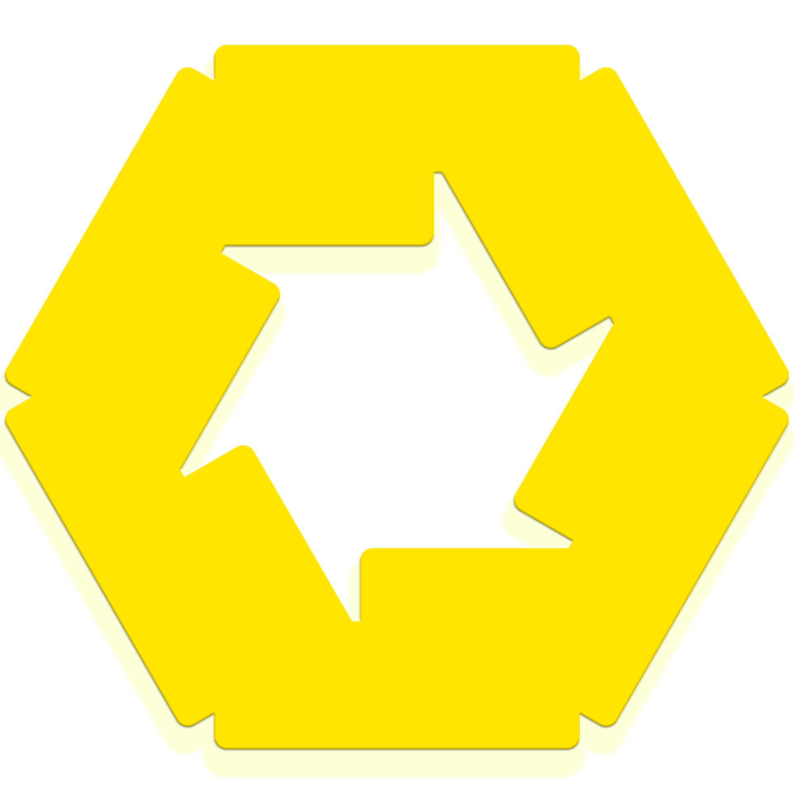

  
  <b>×</b>
  

<h1 align="center">
  Hi , I'm Yash Srivastava
</h1>
<h5 align="center">
  
   |
  
  
</h5>

  
  
  

  

  

    I’m a B.Tech CS-AI student, a keen learner, and a clear researcher with a focus on delivering reliable, polished work. I bring strong experience in scalable systems, distributed AI, and modern web development.
  

  

---

###  Featured Projects

| Project | Description |
| :--- | :--- |
|  **Stealth AI - Steadfast Workspace Agent** | Cross-platform, privacy-first AI agent that helps you build software with a systems-thinking-first approach and acts as a writing assistant for work and personal tasks |
|  **Invision AI - Realtime Criminal Intelligence Monitoring System** | A Distributed, Privacy-Preserving IVA AI for Proactive Urban Criminal Intelligence. |
|  **DataPilot - Autopilot for Data Science** | Open-source automated data science preprocessing and deployment pipeline. |

---

###  Honors & Publications

* **India Innovates '26:** National Finalist (Top 0.03% of 1.26 Crore registrants)
* **IIT Roorkee Changethon:** 2nd Place Winner
* **Build-X & Code & Conquer:** 1st Place Winner
* **Frank Anthony Memorial Debate:** CISCE National Finalist
* **Publication:** *An Engineer’s Guide To Database Orchestration - Build Systems that Don’t Break You*
